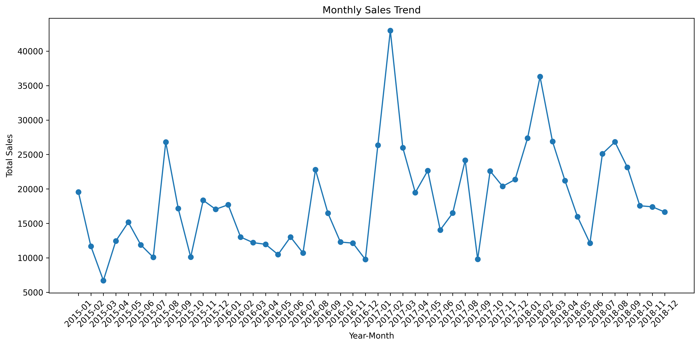
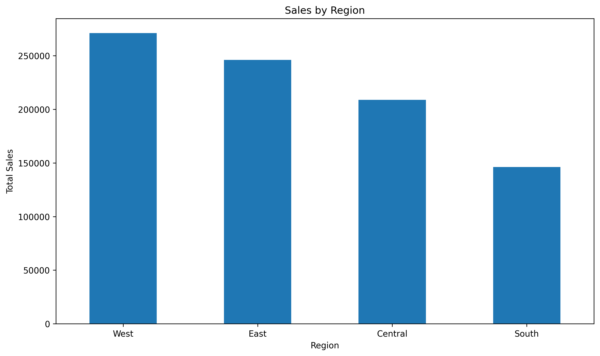
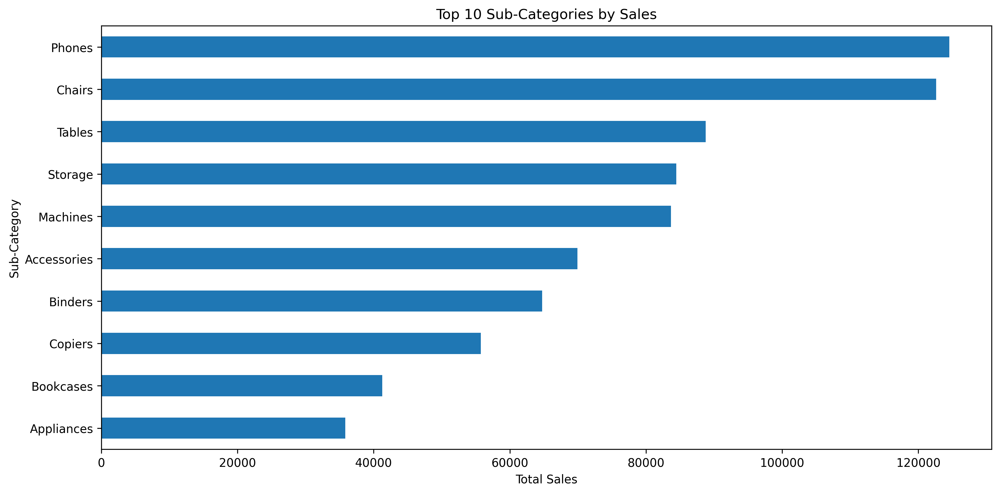

# Sales Performance Analysis

## Overview
This project analyzes retail sales data to understand sales trends, regional performance, and top-performing product sub-categories.

## Objective
The goal of this project is to turn raw sales data into useful business insights by cleaning the dataset, analyzing key metrics, and visualizing performance patterns.

## Dataset
This project uses the **Sales Forecasting** dataset from Kaggle.

Main columns used:
- Order Date
- Ship Date
- Region
- Category
- Sub-Category
- Product Name
- Sales

## Tools Used
- Python
- Pandas
- Matplotlib
- Jupyter Notebook

## Data Cleaning
The dataset was cleaned by:
- converting date columns into datetime format
- converting Sales into numeric format
- removing duplicate rows
- removing rows with missing Order Date or Sales
- creating derived columns such as Order Year, Order Month, and Year-Month

## Key Metrics
- **Total Sales:** 872,363.12
- **Total Orders:** 1,975
- **Total Customers:** 736

## Analysis Performed
This project includes:
- monthly sales trend analysis
- sales by region
- top 10 sub-categories by sales

## Visualizations
### Monthly Sales Trend


### Sales by Region


### Top 10 Sub-Categories by Sales


## Project Structure
```bash
sales-performance-analysis/
  data/
    sales.csv
    sales_cleaned.csv
  notebooks/
    sales_analysis.ipynb
  images/
    monthly_sales_trend.png
    sales_by_region.png
    top_10_subcategories.png
  README.md