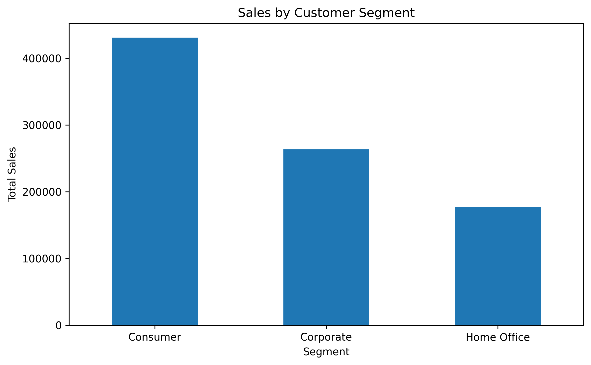
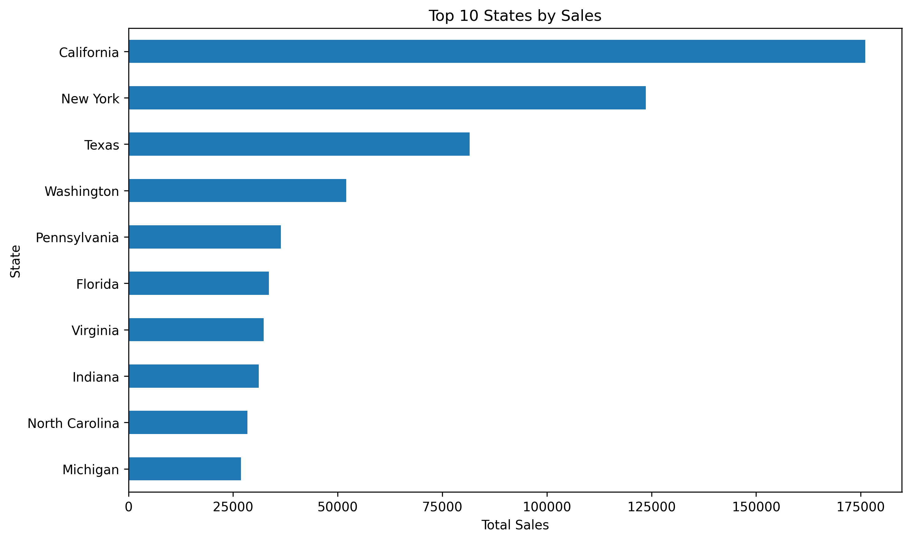
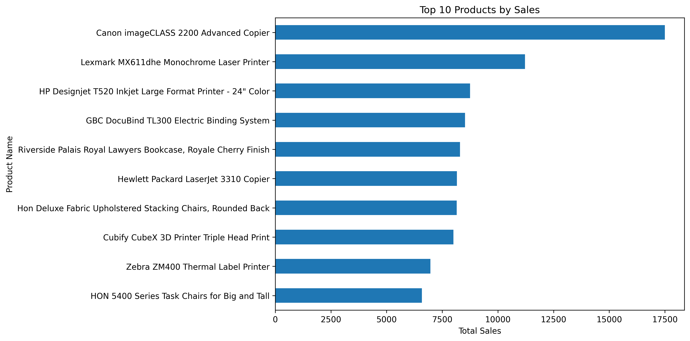
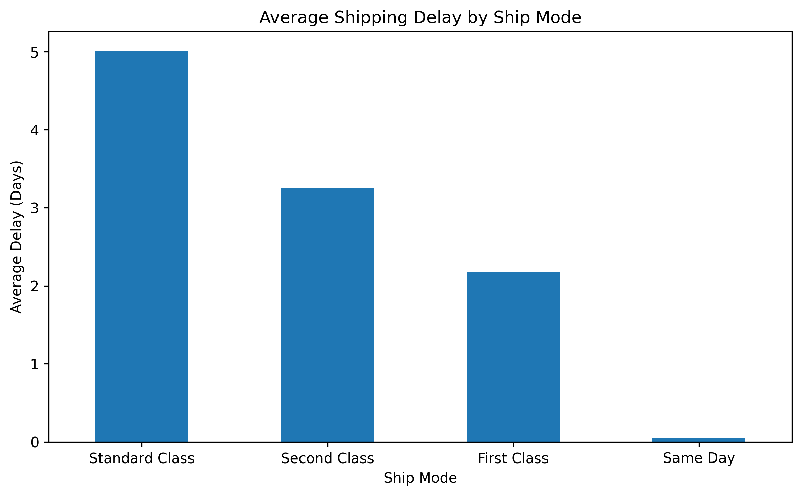

# 📊 Sales Performance Analysis


## 📌 Overview
This project analyzes retail sales data to uncover business insights related to revenue trends, regional performance, customer segments, product sales, and shipping efficiency. The analysis demonstrates a complete workflow from data cleaning and preprocessing to exploratory analysis and visualization.

## 🎯 Business Objective
The goal of this project is to transform raw retail transaction data into actionable business insights that can support decision-making.

Key questions explored:
- How do sales change over time?
- Which regions and states generate the most revenue?
- Which customer segments contribute the most sales?
- Which products and sub-categories are top performers?
- How does shipping performance vary by ship mode?

## 💡 Key Metrics
- **Total Sales:** **$872,363.12**
- **Total Orders:** **1,975**
- **Total Customers:** **736**
- **Average Sales per Order:** **$441.70**

## 🔍 Key Findings
- Revenue reached **$872K+** across **1,975 orders** from **736 customers**.
- Sales performance varied significantly across regions and states, showing strong geographic concentration.
- A small set of sub-categories and products contributed a large share of total revenue.
- Customer segments showed different spending patterns, indicating opportunities for more targeted sales strategies.
- Shipping performance matched expectations: **Standard Class** had the longest delivery time, while **Same Day** was the fastest.

## 📌 Recommendations
- Focus inventory planning and promotional efforts on the highest-performing regions and states.
- Prioritize top-selling products and sub-categories in future campaigns.
- Investigate lower-performing geographic areas to identify growth opportunities.
- Use faster shipping methods strategically for high-value or priority orders.
- Extend the analysis with profit, discount, and return metrics for deeper business insight.

## 🛠️ Tech Stack
- **Python**
- **Pandas**
- **Matplotlib**
- **Jupyter Notebook**

## 🧹 Data Cleaning & Preparation
The dataset was prepared through the following steps:
- Converted `Order Date` and `Ship Date` into datetime format
- Converted `Sales` into numeric format
- Removed duplicate rows
- Removed rows with missing critical values such as `Order Date` and `Sales`
- Created derived time-based columns:
  - `Order Year`
  - `Order Month`
  - `Order Month Name`
  - `Year-Month`
- Calculated `Shipping Delay Days` using the difference between `Ship Date` and `Order Date`

## 📈 Analysis Performed
This project includes:
- Monthly sales trend analysis
- Sales by region
- Sales by customer segment
- Top 10 states by sales
- Top 10 sub-categories by sales
- Top 10 products by sales
- Average shipping delay by ship mode

## 📊 Visualizations

### Monthly Sales Trend
Shows how revenue changes over time and highlights possible seasonality.


### Sales by Region
Compares total sales across regions.


### Sales by Customer Segment
Shows which customer segment contributes the most revenue.



### Top 10 States by Sales
Highlights the strongest-performing states by revenue.



### Top 10 Sub-Categories by Sales
Identifies the highest-performing product sub-categories.


### Top 10 Products by Sales
Shows the products generating the most revenue.



### Average Shipping Delay by Ship Mode
Compares delivery speed across shipping methods.



## 🚀 How to Run Locally

1. Clone this repository:
   ```bash
   git clone https://github.com/YOUR_USERNAME/sales-performance-analysis.git